# UAV Autonomous Telemetry and Slung-Payload SITL Experiments

ROS 2 + PX4 SITL workspace for autonomous UAV offboard control, telemetry logging, figure-8 trajectory validation, and early slung-payload simulation in Gazebo Classic.

This repository captures the current project state, including runnable ROS 2 nodes, PX4/Gazebo payload integration files, generated CSV logs, and plot-based experiment reports.

Final PDF report: [`reports/final_research_report_2026-06-07/uav_slung_payload_sitl_research_report_2026-06-07.pdf`](reports/final_research_report_2026-06-07/uav_slung_payload_sitl_research_report_2026-06-07.pdf)

Latest controller benchmark: [`reports/controller_benchmark_2026-06-08/CONTROLLER_BENCHMARK_SUMMARY.md`](reports/controller_benchmark_2026-06-08/CONTROLLER_BENCHMARK_SUMMARY.md)

## Project Snapshot

| | |
| --- | --- |
| **My work** | Developed and validated the ROS 2 offboard-control, telemetry, experiment, disturbance-testing, and report-generation workflow |
| **Stack** | ROS 2, PX4 SITL, Gazebo Classic, Python, NumPy, pandas, Matplotlib |
| **Evidence** | Start with the [final research report](reports/final_research_report_2026-06-07/uav_slung_payload_sitl_research_report_2026-06-07.pdf), [controller benchmark](reports/controller_benchmark_2026-06-08/CONTROLLER_BENCHMARK_SUMMARY.md), and [run commands](#run-commands) |

Latest controlled validation:

- Wind disturbance envelope screening: [`reports/wind_envelope_validation_2026-07-25/WIND_DISTURBANCE_ENVELOPE_SUMMARY.md`](reports/wind_envelope_validation_2026-07-25/WIND_DISTURBANCE_ENVELOPE_SUMMARY.md)
- Vertical updraft validation: [`reports/wind_disturbance_updraft_z5_2026-07-25/UPDRAFT_Z5_SUMMARY.md`](reports/wind_disturbance_updraft_z5_2026-07-25/UPDRAFT_Z5_SUMMARY.md)
- Gust disturbance validation: [`reports/wind_disturbance_gust_y10_2026-07-25/GUST_Y10_SUMMARY.md`](reports/wind_disturbance_gust_y10_2026-07-25/GUST_Y10_SUMMARY.md)
- Constant crosswind validation: [`reports/wind_disturbance_crosswind_y5_2026-07-25/CROSSWIND_Y5_SUMMARY.md`](reports/wind_disturbance_crosswind_y5_2026-07-25/CROSSWIND_Y5_SUMMARY.md)
- Payload parameter sweep: [`reports/payload_parameter_sweep_2026-07-22/PAYLOAD_PARAMETER_SWEEP_SUMMARY.md`](reports/payload_parameter_sweep_2026-07-22/PAYLOAD_PARAMETER_SWEEP_SUMMARY.md)
- Speed sweep summary: [`reports/speed_sweep_validation_2026-07-22/SPEED_SWEEP_SUMMARY.md`](reports/speed_sweep_validation_2026-07-22/SPEED_SWEEP_SUMMARY.md)
- `10+10` repeatability summary: [`reports/repeatability_validation_10x10_2026-07-22/REPEATABILITY_SUMMARY.md`](reports/repeatability_validation_10x10_2026-07-22/REPEATABILITY_SUMMARY.md)
- `5+5` repeatability summary: [`reports/repeatability_validation_5x5_2026-07-21/REPEATABILITY_SUMMARY.md`](reports/repeatability_validation_5x5_2026-07-21/REPEATABILITY_SUMMARY.md)
- Baseline vs geometric comparison: [`reports/single_validation_2026-07-21_controller_comparison/CONTROLLED_BASELINE_VS_GEOMETRIC.md`](reports/single_validation_2026-07-21_controller_comparison/CONTROLLED_BASELINE_VS_GEOMETRIC.md)

## Research Workflow

Development now proceeds through named phase or stage branches and reviewed
pull requests. See [`CONTRIBUTING.md`](CONTRIBUTING.md) for branch naming,
validation, evidence, and data-retention requirements.

The publication path and exit criteria for payload-state feedback, disturbance
adaptation, statistical validation, and HIL/flight testing are tracked in
[`docs/RESEARCH_ROADMAP.md`](docs/RESEARCH_ROADMAP.md).

New single and batch validation runs write versioned experiment provenance and
retain raw telemetry by default. See
[`docs/EXPERIMENT_PROVENANCE.md`](docs/EXPERIMENT_PROVENANCE.md).

Repeated controller comparisons report seeded bootstrap confidence intervals
and Hedges' `g` effect sizes. See
[`docs/STATISTICAL_METHODS.md`](docs/STATISTICAL_METHODS.md).

## Project Status

| Stage | Status | Evidence |
| --- | --- | --- |
| PX4 SITL + Gazebo Classic depth-camera vehicle | Complete | `iris_depth_camera` boots and publishes depth/pointcloud topics |
| ROS 2 offboard control bridge | Complete | MicroXRCEAgent and `/fmu/in/*`, `/fmu/out/*` topics verified |
| Continuous figure-8 trajectory without payload | Complete | Tuned run: post-takeoff mean error `0.415 m`, RMS `0.442 m` |
| Telemetry and plotting pipeline | Complete | CSV logs plus XY, XYZ-time, 3D, and error plots generated |
| Slung-payload native model integration | Complete hover baseline | Native Iris-derived `iris_depth_payload` with internal `base_link -> slung_payload` ball joint hovers |
| Physical payload joint validation | Hover solved | Native ball-joint payload reaches `-5 m` NED hover with post-12s mean error `0.061 m` |
| Slung-payload Figure-8 validation | Complete baseline | Native ball-joint payload completed sustained 8-shaped trajectory with post-25s mean error `0.462 m` |
| Controller benchmark | Complete | Baseline and geometric-controller comparison added |
| Geometric attitude/thrust controller prototype | No-payload commissioned | Versioned attitude-topic fix validated; tuned post-20s mean error `0.212 m` |
| Geometric slung-payload Figure-8 | Complete first pass | Payload run succeeded with post-20s mean error `0.315 m` |
| Matched-rate controller comparison | Complete | At `omega=0.25`, geometric control reduced mean payload tracking error by `20.2%` |
| Payload swing instrumentation | Figure-8 calibrated | Same-frame Gazebo logger validated; geometric Figure-8 mean cable length `1.001 m`, mean cable angle `31.119 deg` |
| Calibrated payload swing comparison | Complete | Geometric control reduced mean tracking error by `21.0%` and mean cable angle by `11.7%` vs PX4 position/velocity |
| Geometric altitude tuning | Complete | Tuned `hover_thrust=0.72` brings mean altitude to `-4.994 m` NED and mean error to `0.327 m` |
| Controlled `10+10` repeatability | Complete | Geometric control reduced mean 3D error by `23.7%`, RMS error by `24.4%`, mean swing by `8.9%`, and mean cable angle by `10.1%` |
| Controlled speed sweep | Complete | Geometric control is speed-dependent: weaker tracking at `0.15-0.20 rad/s`, stronger tracking and lower swing at `0.25-0.30 rad/s` |
| Payload parameter sweep | Complete screening | Geometric control remains strong for cable-length changes, but `0.20 kg` payload mass exposes a tracking/swing tradeoff |
| Constant crosswind validation | Complete screening | Under `5 m/s` Y-crosswind, geometric control still lowers swing by `9.2%` but tracking error is much worse than PX4 baseline |
| Gust disturbance validation | Complete screening | Under a `10 m/s` gust, geometric control improves mean error and swing but has larger peak tracking and cable-angle excursions |
| Vertical updraft validation | Complete screening | Under `5 m/s` +Z wind, PX4 baseline failed altitude validation while geometric control completed the circuit with altitude bias |
| Wind disturbance envelope | Complete screening batch | Constant Y-crosswind tested at `0, 2.5, 5, 7.5, 10 m/s`; geometric control keeps `~9-10%` swing reduction but tracking degrades beyond clean air |

## Repository Layout

```text
.
|-- README.md
|-- CONTRIBUTING.md
|-- requirements-analysis.txt
|-- docs/
|   `-- RESEARCH_ROADMAP.md
|-- tests/
|   `-- test_run_single_validation.py
|-- ros2_ws/
|   `-- src/uav_control/
|       |-- src/
|       |   |-- offboard_control.cpp
|       |   |-- telemetry_logger.cpp
|       |   |-- figure8_offboard.cpp
|       |   |-- figure8_metrics_logger.cpp
|       |   |-- hover_offboard.cpp
|       |   `-- geometric_figure8_attitude.cpp
|       |-- scripts/
|       |   `-- payload_swing_logger
|       `-- launch/
|           |-- figure8_experiment.launch.py
|           |-- figure8_payload_experiment.launch.py
|           |-- geometric_figure8_experiment.launch.py
|           `-- payload_hover_experiment.launch.py
|-- px4_payload_integration/
|   `-- ... PX4 files to copy into PX4-Autopilot ...
|-- reports/
|   |-- fig8_run_2026-06-04/
|   |-- fig8_metrics_tuned_2026-06-04/
|   |-- payload_hover_2026-06-05/
|   |-- payload_hover_singlelink_2026-06-05/
|   |-- payload_hover_nested_free_2026-06-05/
|   |-- payload_hover_native_ball_nocollision_2026-06-05/
|   |-- payload_figure8_native_ball_2026-06-07/
|   |-- hover_control_check_2026-06-05/
|   |-- controller_benchmark_2026-06-08/
|   |-- geometric_controller_stage_2026-06-08/
|   |-- payload_geometric_figure8_2026-06-08/
|   |-- payload_geometric_matched_omega025_2026-06-08/
|   `-- payload_swing_instrumentation_2026-06-08/
`-- tools/
    |-- legacy_plot_data.py
    `-- summarize_benchmarks.py
```

## System Architecture

- Flight stack: PX4 Autopilot SITL
- Simulator: Gazebo Classic 11
- Vehicle baseline: `iris_depth_camera`
- Payload vehicle under development: `iris_depth_payload`
- Middleware bridge: Micro XRCE-DDS Agent
- Autonomy layer: ROS 2 Humble, C++ nodes plus Python logger
- Main telemetry topics:
  - `/fmu/in/offboard_control_mode`
  - `/fmu/in/trajectory_setpoint`
  - `/fmu/in/vehicle_command`
  - `/fmu/out/vehicle_local_position_v1`

## Main ROS 2 Nodes

| Node | File | Purpose |
| --- | --- | --- |
| `offboard_control` | `ros2_ws/src/uav_control/src/offboard_control.cpp` | Original waypoint/offboard control node |
| `telemetry_logger` | `ros2_ws/src/uav_control/src/telemetry_logger.cpp` | Basic telemetry CSV logger |
| `figure8_offboard` | `ros2_ws/src/uav_control/src/figure8_offboard.cpp` | Continuous lemniscate/figure-8 controller |
| `figure8_metrics_logger` | `ros2_ws/src/uav_control/src/figure8_metrics_logger.cpp` | Logs actual vs reference trajectory metrics |
| `hover_offboard` | `ros2_ws/src/uav_control/src/hover_offboard.cpp` | Constant-position hover validation controller |
| `geometric_figure8_attitude` | `ros2_ws/src/uav_control/src/geometric_figure8_attitude.cpp` | SE(3)-style attitude/thrust Figure-8 prototype |
| `payload_swing_logger` | `ros2_ws/src/uav_control/scripts/payload_swing_logger` | Parses Gazebo pose sniffer UDP packets and logs payload swing estimates |

## Key Results

### 1. Initial Figure-8 SITL Run

The first validated figure-8 run confirmed that PX4 SITL, Gazebo Classic, MicroXRCEAgent, and ROS 2 offboard control were connected end to end.

Artifacts:

- Report: [`reports/fig8_run_2026-06-04/REPORT.md`](reports/fig8_run_2026-06-04/REPORT.md)
- XY plot: [`reports/fig8_run_2026-06-04/figure8_xy.png`](reports/fig8_run_2026-06-04/figure8_xy.png)
- XYZ-time plot: [`reports/fig8_run_2026-06-04/figure8_xyz_vs_time.png`](reports/fig8_run_2026-06-04/figure8_xyz_vs_time.png)
- 3D plot: [`reports/fig8_run_2026-06-04/figure8_3d.png`](reports/fig8_run_2026-06-04/figure8_3d.png)

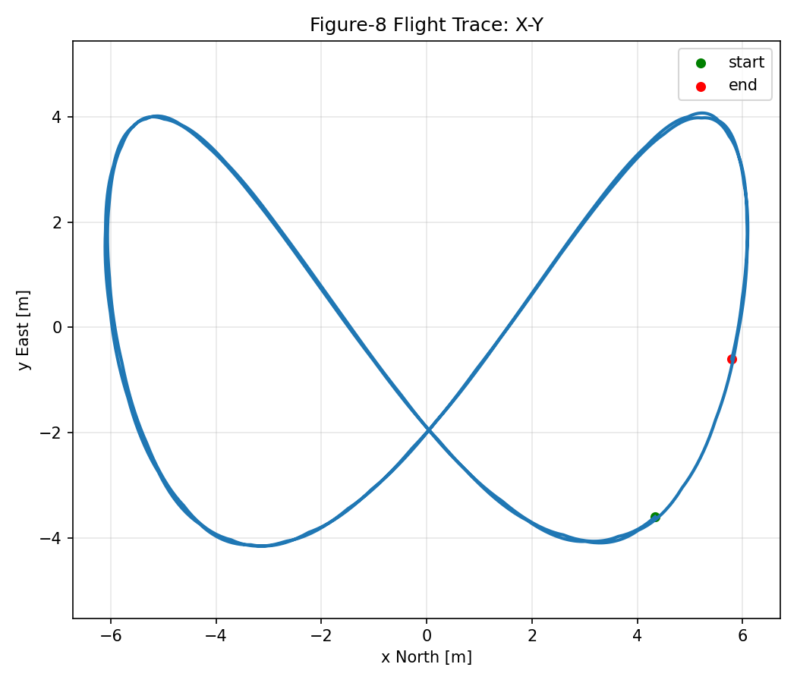

### 2. Tuned Figure-8 Tracking

The slower tuned figure-8 run used `omega=0.25 rad/s` and produced a much cleaner steady-state tracking result.

Artifacts:

- Metrics report: [`reports/fig8_metrics_tuned_2026-06-04/METRICS.md`](reports/fig8_metrics_tuned_2026-06-04/METRICS.md)
- XY comparison: [`reports/fig8_metrics_tuned_2026-06-04/actual_vs_reference_xy.png`](reports/fig8_metrics_tuned_2026-06-04/actual_vs_reference_xy.png)
- Steady-state XY comparison: [`reports/fig8_metrics_tuned_2026-06-04/actual_vs_reference_xy_steady.png`](reports/fig8_metrics_tuned_2026-06-04/actual_vs_reference_xy_steady.png)
- XYZ-time comparison: [`reports/fig8_metrics_tuned_2026-06-04/actual_vs_reference_xyz_time.png`](reports/fig8_metrics_tuned_2026-06-04/actual_vs_reference_xyz_time.png)
- Tracking error: [`reports/fig8_metrics_tuned_2026-06-04/tracking_error_time.png`](reports/fig8_metrics_tuned_2026-06-04/tracking_error_time.png)

Metrics:

| Window | Samples | Mean Error | RMS Error | Max Error |
| --- | ---: | ---: | ---: | ---: |
| Full run | 4305 | `0.839 m` | `1.666 m` | `6.981 m` |
| Post-takeoff, `t >= 12 s` | 3705 | `0.415 m` | `0.442 m` | `0.660 m` |

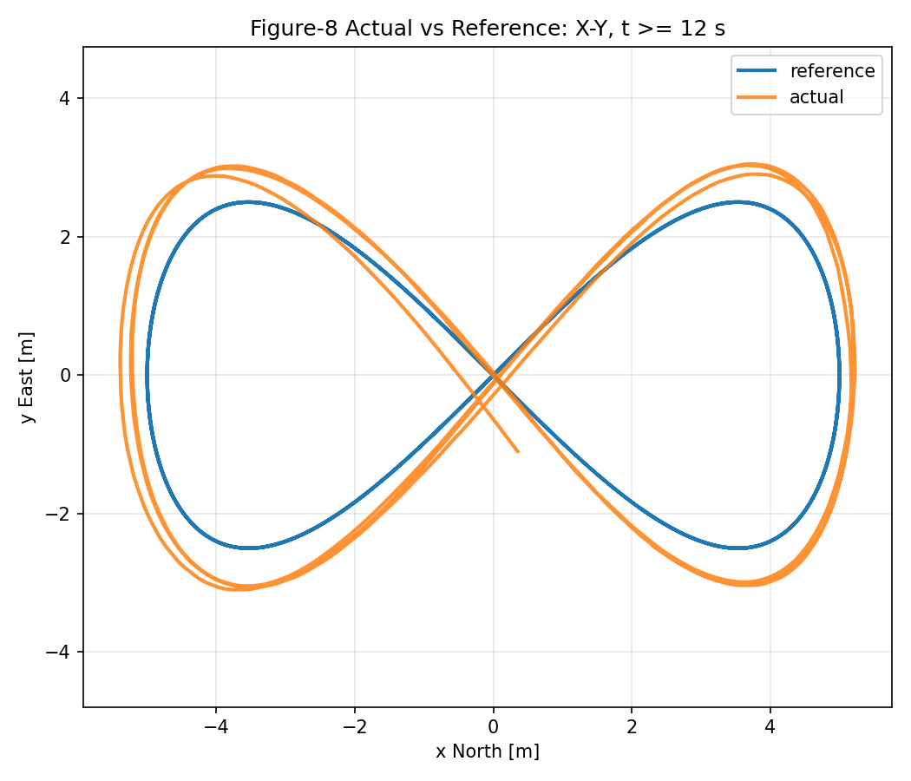

### 3. Slung-Payload Integration Attempt

A Gazebo Classic payload vehicle was added:

- Model: `iris_depth_payload`
- Airframe: `1020_gazebo-classic_iris_depth_payload`
- Payload mass in current lightweight baseline: `0.05 kg`
- Cable link: near-zero mass, 1 m visual cable
- Payload pose logging: Gazebo pose sniffer UDP on `127.0.0.1:7001`

Artifacts:

- Payload status report: [`reports/payload_fig8_light_2026-06-05/PAYLOAD_STATUS_REPORT.md`](reports/payload_fig8_light_2026-06-05/PAYLOAD_STATUS_REPORT.md)
- Payload XY tracking: [`reports/payload_fig8_light_2026-06-05/payload_xy_tracking.png`](reports/payload_fig8_light_2026-06-05/payload_xy_tracking.png)
- Payload XYZ-time: [`reports/payload_fig8_light_2026-06-05/payload_xyz_vs_time.png`](reports/payload_fig8_light_2026-06-05/payload_xyz_vs_time.png)
- Payload cable angle: [`reports/payload_fig8_light_2026-06-05/payload_cable_angle.png`](reports/payload_fig8_light_2026-06-05/payload_cable_angle.png)

Current finding: the payload model boots and PX4 accepts offboard arming, but it does not produce a valid airborne figure-8. The vehicle remains near ground altitude, so the payload model is not yet ready to present as a completed slung-payload circuit.

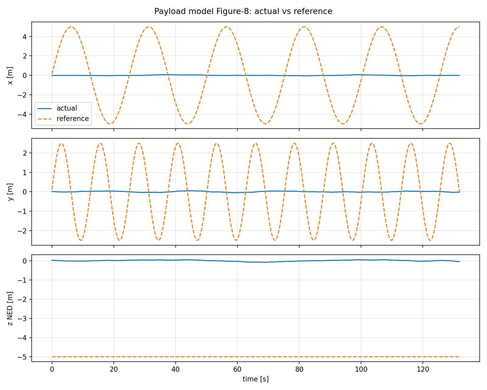

### 4. Payload Hover Validation

To isolate the problem, a hover-only controller was created and tested.

Payload hover test:

- Target: `x=0`, `y=0`, `z=-5 m` NED
- PX4 accepted arming/offboard and reported takeoff.
- Actual NED `z` stayed near ground level: `-0.083 m` to `0.050 m`.
- Mean hover tracking error: `4.997 m`.

Artifacts:

- Payload hover report: [`reports/payload_hover_2026-06-05/HOVER_VALIDATION_REPORT.md`](reports/payload_hover_2026-06-05/HOVER_VALIDATION_REPORT.md)
- XY drift plot: [`reports/payload_hover_2026-06-05/hover_xy_drift.png`](reports/payload_hover_2026-06-05/hover_xy_drift.png)
- 3D hover trajectory: [`reports/payload_hover_2026-06-05/payload_hover_3d.png`](reports/payload_hover_2026-06-05/payload_hover_3d.png)
- XYZ-time plot: [`reports/payload_hover_2026-06-05/hover_xyz_vs_time.png`](reports/payload_hover_2026-06-05/hover_xyz_vs_time.png)
- Error plot: [`reports/payload_hover_2026-06-05/hover_tracking_error.png`](reports/payload_hover_2026-06-05/hover_tracking_error.png)

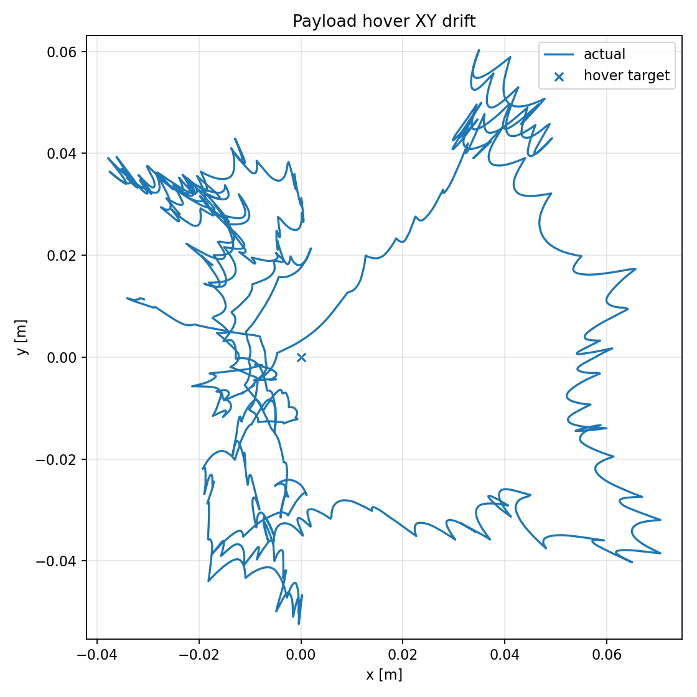

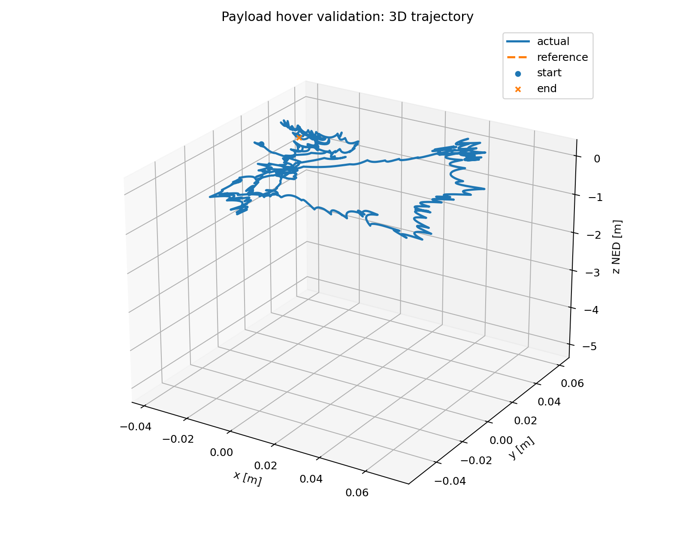

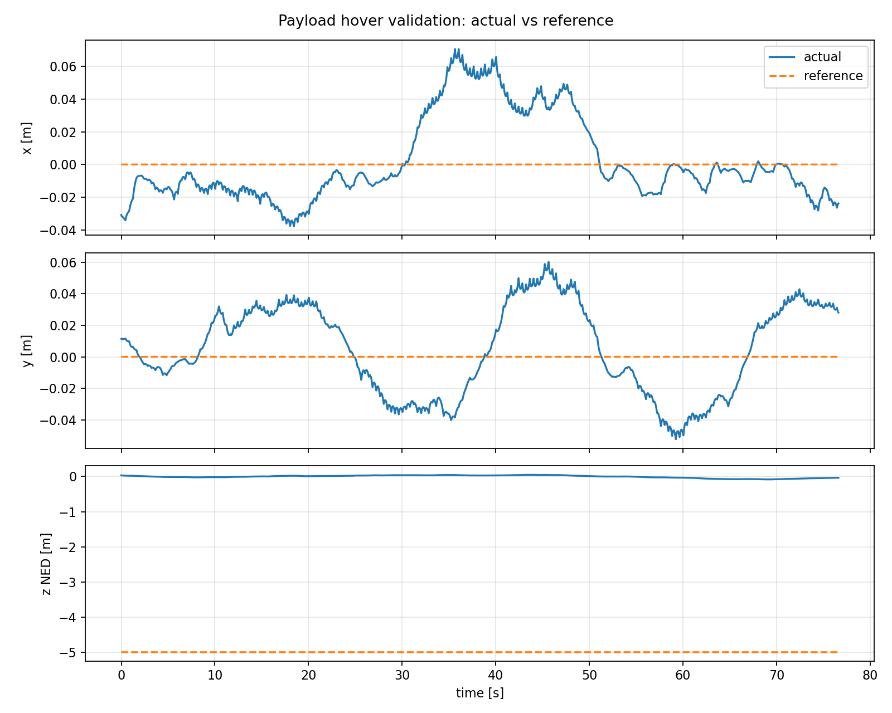

### 5. Single-Link Payload Debugging Pass

The payload SDF was simplified from a two-link cable/body setup into a single ball-joint pendulum baseline. This was done to isolate whether the original two-joint payload chain was the cause of the failed climb.

Result:

- PX4 accepted offboard control, armed, and reported takeoff detection.
- The slung payload is visible in Gazebo: drone body, cable, and orange payload mass.
- The vehicle still stayed near ground level.
- Final NED `z`: `0.028 m` against the target `-5.000 m`.
- Post-12s mean tracking error: `5.008 m`.
- Post-12s mean XY drift: `0.035 m`.

Artifacts:

- Report: [`reports/payload_hover_singlelink_2026-06-05/HOVER_SINGLELINK_REPORT.md`](reports/payload_hover_singlelink_2026-06-05/HOVER_SINGLELINK_REPORT.md)
- Slung payload close-up: [`reports/payload_hover_singlelink_2026-06-05/gazebo_payload_slung_payload_closeup.png`](reports/payload_hover_singlelink_2026-06-05/gazebo_payload_slung_payload_closeup.png)
- Gazebo window screenshot: [`reports/payload_hover_singlelink_2026-06-05/gazebo_payload_window.png`](reports/payload_hover_singlelink_2026-06-05/gazebo_payload_window.png)
- XY drift plot: [`reports/payload_hover_singlelink_2026-06-05/hover_xy_drift.png`](reports/payload_hover_singlelink_2026-06-05/hover_xy_drift.png)
- 3D hover trajectory: [`reports/payload_hover_singlelink_2026-06-05/payload_hover_3d.png`](reports/payload_hover_singlelink_2026-06-05/payload_hover_3d.png)
- Payload relative motion 3D plot: [`reports/payload_hover_singlelink_2026-06-05/payload_relative_motion_3d.png`](reports/payload_hover_singlelink_2026-06-05/payload_relative_motion_3d.png)
- Payload swing metrics: [`reports/payload_hover_singlelink_2026-06-05/payload_swing_metrics.png`](reports/payload_hover_singlelink_2026-06-05/payload_swing_metrics.png)

This confirms the next engineering task is not the ROS 2 offboard node; it is the Gazebo Classic payload joint/frame setup.

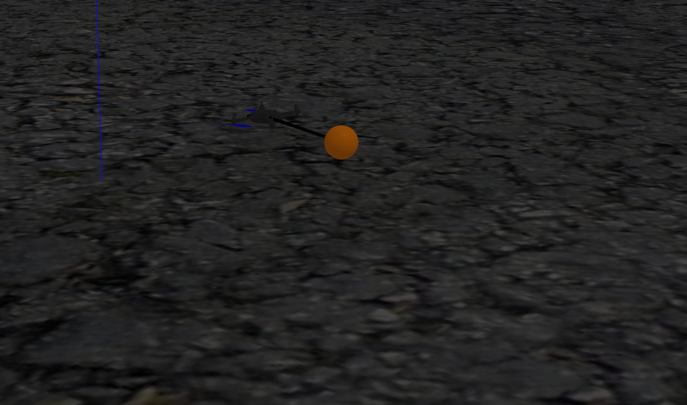

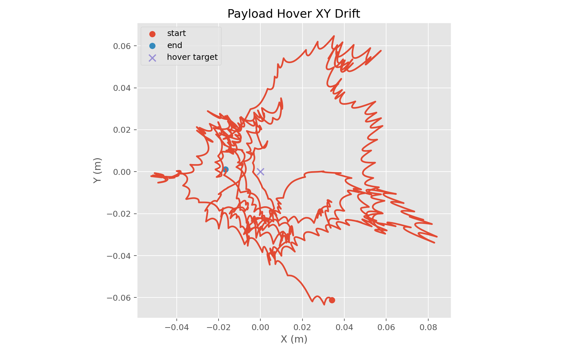

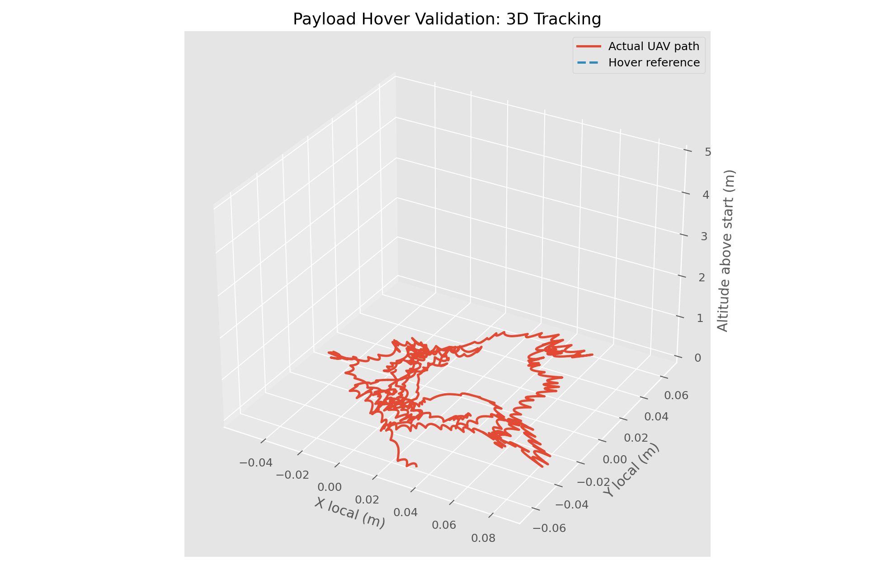

### 6. No-Payload Hover Control Check

The exact same `hover_offboard` node was run on the known-good `iris_depth_camera` model.

Result:

- Final NED `z`: `-5.010 m`
- Post-12s mean error: `0.067 m`
- Conclusion: ROS 2 offboard control is valid. The failure is isolated to the payload SDF/joint physics.

Artifacts:

- Control report: [`reports/hover_control_check_2026-06-05/HOVER_CONTROL_CHECK.md`](reports/hover_control_check_2026-06-05/HOVER_CONTROL_CHECK.md)
- Z plot: [`reports/hover_control_check_2026-06-05/hover_control_check_z.png`](reports/hover_control_check_2026-06-05/hover_control_check_z.png)
- XY drift plot: [`reports/hover_control_check_2026-06-05/hover_control_check_xy_drift.png`](reports/hover_control_check_2026-06-05/hover_control_check_xy_drift.png)
- 3D hover trajectory: [`reports/hover_control_check_2026-06-05/hover_control_check_3d.png`](reports/hover_control_check_2026-06-05/hover_control_check_3d.png)

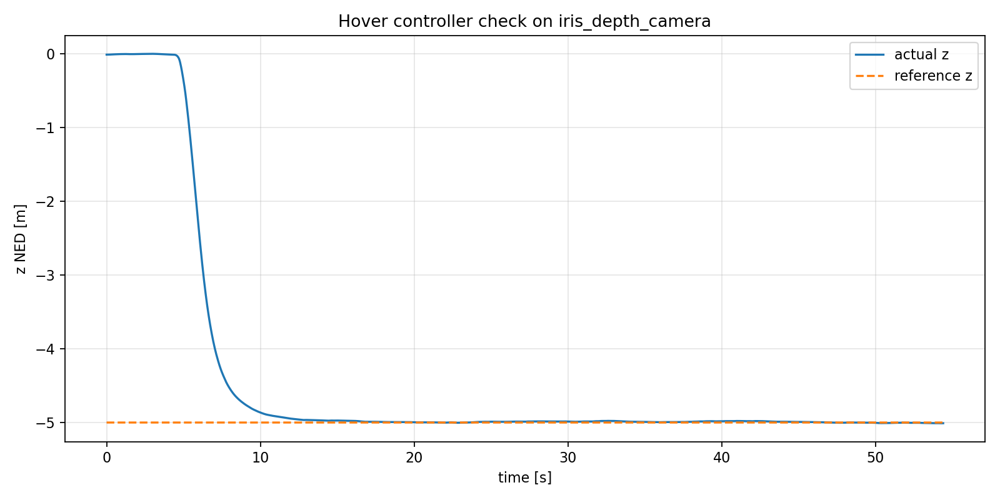

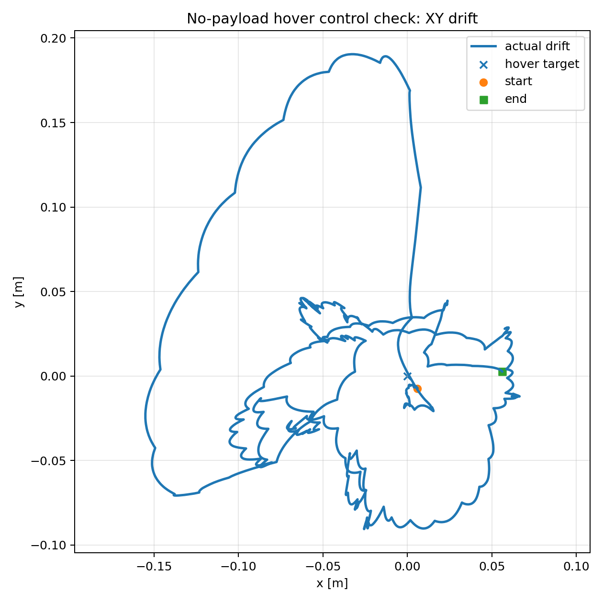

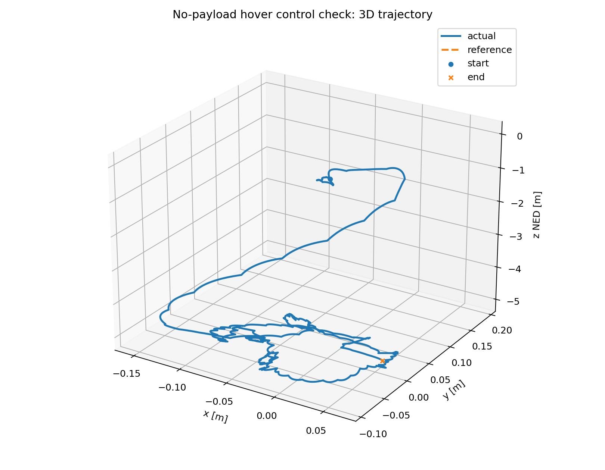

### 7. Payload Joint Isolation

The payload model was moved into its own nested Gazebo model, `slung_payload_ball`, to avoid making the payload a top-level link in the PX4 vehicle wrapper.

Result:

- The same `iris_depth_payload` target hovers correctly when the nested payload is present but not physically jointed.
- Final NED `z`: `-5.000 m`.
- Post-12s mean tracking error: `0.062 m`.
- Post-12s RMS tracking error: `0.069 m`.
- Adding a fixed joint from `iris::base_link` to the nested payload still prevents climb.

Current finding: the next blocker is specifically the direct Gazebo Classic payload joint attachment. The target, airframe, ROS 2 offboard node, and nested payload visual/model are healthy.

Artifacts:

- Report: [`reports/payload_hover_nested_free_2026-06-05/PAYLOAD_JOINT_ISOLATION_REPORT.md`](reports/payload_hover_nested_free_2026-06-05/PAYLOAD_JOINT_ISOLATION_REPORT.md)
- XYZ-time plot: [`reports/payload_hover_nested_free_2026-06-05/nested_free_hover_xyz_vs_time.png`](reports/payload_hover_nested_free_2026-06-05/nested_free_hover_xyz_vs_time.png)
- XY drift plot: [`reports/payload_hover_nested_free_2026-06-05/nested_free_hover_xy_drift.png`](reports/payload_hover_nested_free_2026-06-05/nested_free_hover_xy_drift.png)
- 3D hover plot: [`reports/payload_hover_nested_free_2026-06-05/nested_free_payload_hover_3d.png`](reports/payload_hover_nested_free_2026-06-05/nested_free_payload_hover_3d.png)
- Isolation altitude comparison: [`reports/payload_hover_nested_free_2026-06-05/payload_isolation_altitude_comparison.png`](reports/payload_hover_nested_free_2026-06-05/payload_isolation_altitude_comparison.png)
- Isolation error comparison: [`reports/payload_hover_nested_free_2026-06-05/payload_isolation_error_comparison.png`](reports/payload_hover_nested_free_2026-06-05/payload_isolation_error_comparison.png)

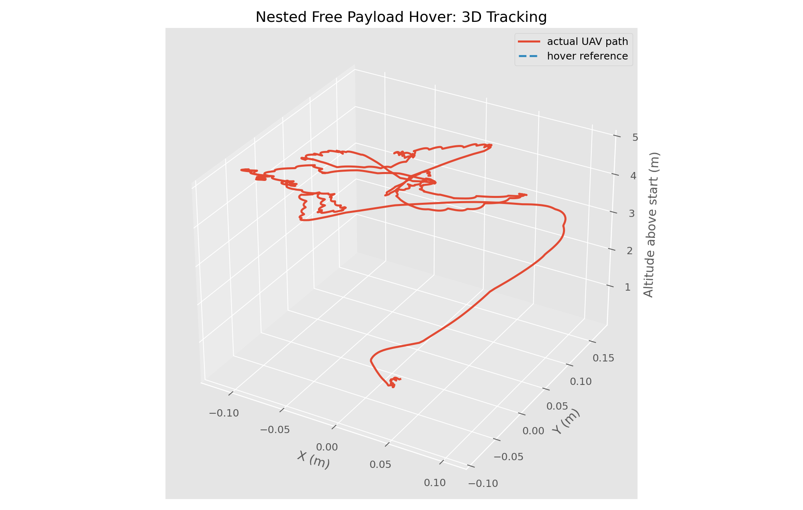

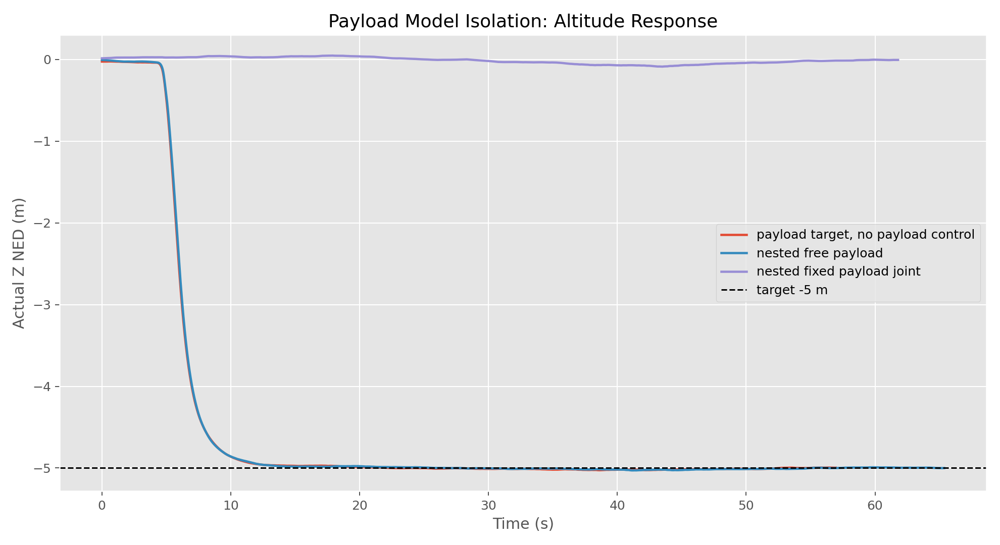

### 8. Native Ball-Joint Payload Link Fix

The payload-link issue was solved by replacing the wrapper/nested-Iris SDF with a native Iris-derived `iris_depth_payload.sdf`. The payload link now lives inside the same Gazebo model as `base_link`, and the physical payload joint is internal to the model.

Fix:

- Parent link: `base_link`
- Child link: `slung_payload`
- Joint type: `ball`
- Payload mass: `0.05 kg`
- Payload visual: 1 m cable plus orange payload sphere
- Payload collision removed for the flight baseline to avoid ground-contact locking at spawn

Result:

- Final NED `z`: `-4.995 m`.
- Post-12s mean tracking error: `0.061 m`.
- Post-12s RMS tracking error: `0.069 m`.
- Payload swing samples: `10467`.
- GUI screenshot confirms the UAV hovering with a visible slung payload.

Artifacts:

- Report: [`reports/payload_hover_native_ball_nocollision_2026-06-05/NATIVE_PAYLOAD_LINK_FIX_REPORT.md`](reports/payload_hover_native_ball_nocollision_2026-06-05/NATIVE_PAYLOAD_LINK_FIX_REPORT.md)
- Gazebo hover close-up: [`reports/payload_hover_native_ball_nocollision_2026-06-05/native_ball_gazebo_hover_closeup.png`](reports/payload_hover_native_ball_nocollision_2026-06-05/native_ball_gazebo_hover_closeup.png)
- XYZ-time plot: [`reports/payload_hover_native_ball_nocollision_2026-06-05/native_ball_hover_xyz_vs_time.png`](reports/payload_hover_native_ball_nocollision_2026-06-05/native_ball_hover_xyz_vs_time.png)
- XY drift plot: [`reports/payload_hover_native_ball_nocollision_2026-06-05/native_ball_hover_xy_drift.png`](reports/payload_hover_native_ball_nocollision_2026-06-05/native_ball_hover_xy_drift.png)
- 3D hover plot: [`reports/payload_hover_native_ball_nocollision_2026-06-05/native_ball_payload_hover_3d.png`](reports/payload_hover_native_ball_nocollision_2026-06-05/native_ball_payload_hover_3d.png)
- Payload swing plot: [`reports/payload_hover_native_ball_nocollision_2026-06-05/native_ball_payload_swing_metrics.png`](reports/payload_hover_native_ball_nocollision_2026-06-05/native_ball_payload_swing_metrics.png)
- Altitude comparison: [`reports/payload_hover_native_ball_nocollision_2026-06-05/native_payload_link_fix_altitude_comparison.png`](reports/payload_hover_native_ball_nocollision_2026-06-05/native_payload_link_fix_altitude_comparison.png)

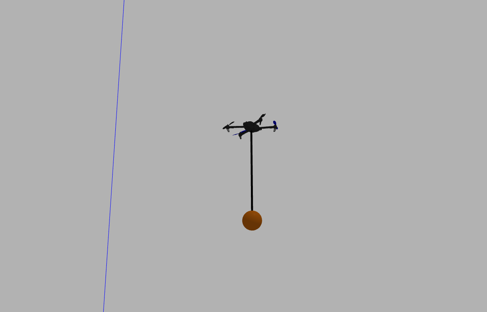

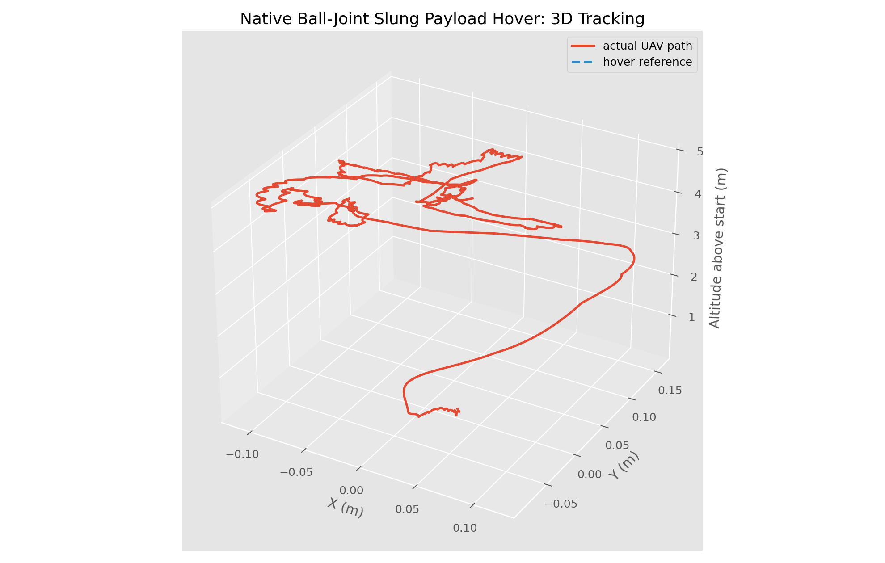

### 9. Native Ball-Joint Payload Figure-8

The fixed native `iris_depth_payload` model was run through Professor Zavoli's requested 8-shaped trajectory using PX4 offboard position/velocity setpoints.

Result:

- Duration: `150.91 s`.
- Post-25s mean 3D tracking error: `0.462 m`.
- Post-25s RMS 3D tracking error: `0.493 m`.
- Post-25s maximum 3D tracking error: `0.796 m`.
- Mean post-25s altitude: `-4.996 m` NED.
- Actual X range: `-5.489 m` to `5.291 m`.
- Actual Y range: `-3.158 m` to `3.083 m`.
- Payload swing samples: `37644`.

Artifacts:

- Report: [`reports/payload_figure8_native_ball_2026-06-07/PAYLOAD_FIGURE8_VALIDATION_REPORT.md`](reports/payload_figure8_native_ball_2026-06-07/PAYLOAD_FIGURE8_VALIDATION_REPORT.md)
- XY tracking: [`reports/payload_figure8_native_ball_2026-06-07/payload_figure8_xy_tracking.png`](reports/payload_figure8_native_ball_2026-06-07/payload_figure8_xy_tracking.png)
- Steady XY tracking: [`reports/payload_figure8_native_ball_2026-06-07/payload_figure8_xy_tracking_steady.png`](reports/payload_figure8_native_ball_2026-06-07/payload_figure8_xy_tracking_steady.png)
- XYZ vs time: [`reports/payload_figure8_native_ball_2026-06-07/payload_figure8_xyz_vs_time.png`](reports/payload_figure8_native_ball_2026-06-07/payload_figure8_xyz_vs_time.png)
- 3D tracking: [`reports/payload_figure8_native_ball_2026-06-07/payload_figure8_3d_tracking.png`](reports/payload_figure8_native_ball_2026-06-07/payload_figure8_3d_tracking.png)
- Tracking error: [`reports/payload_figure8_native_ball_2026-06-07/payload_figure8_tracking_error.png`](reports/payload_figure8_native_ball_2026-06-07/payload_figure8_tracking_error.png)
- Payload swing: [`reports/payload_figure8_native_ball_2026-06-07/payload_figure8_swing_metrics.png`](reports/payload_figure8_native_ball_2026-06-07/payload_figure8_swing_metrics.png)
- Payload relative motion: [`reports/payload_figure8_native_ball_2026-06-07/payload_figure8_relative_motion_3d.png`](reports/payload_figure8_native_ball_2026-06-07/payload_figure8_relative_motion_3d.png)

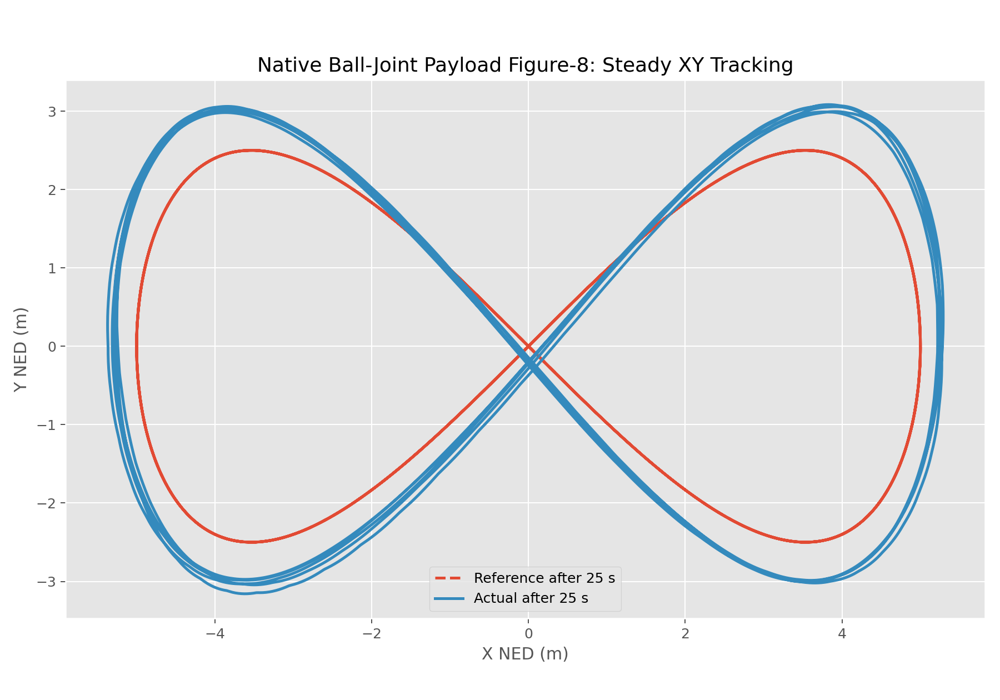

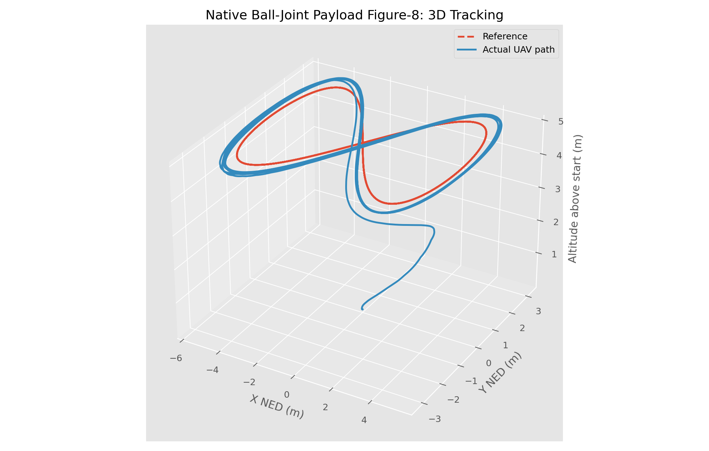

### 10. Controller Benchmark and Next Stage

The completed runs were consolidated into a single benchmark view before moving into controller redesign. This creates a clear baseline for comparing future geometric or payload-aware controllers.

Artifacts:

- Benchmark summary: [`reports/controller_benchmark_2026-06-08/CONTROLLER_BENCHMARK_SUMMARY.md`](reports/controller_benchmark_2026-06-08/CONTROLLER_BENCHMARK_SUMMARY.md)
- Benchmark generator: [`tools/summarize_benchmarks.py`](tools/summarize_benchmarks.py)

Key comparison:

| Case | Steady Mean 3D Error | Steady RMS 3D Error | Final Z NED |
| --- | ---: | ---: | ---: |
| No-payload Figure-8 tuned baseline | `0.415 m` | `0.442 m` | `-4.983 m` |
| Native ball-joint payload hover | `0.061 m` | `0.069 m` | `-4.995 m` |
| Native ball-joint payload Figure-8 | `0.462 m` | `0.493 m` | `-4.987 m` |

### 11. Geometric Attitude/Thrust Prototype

The next controller stage has been started as a separate ROS 2 node so the validated PX4 position/velocity baseline remains intact. The prototype computes a desired acceleration from position/velocity tracking error, converts it into an attitude quaternion and normalized thrust command, and publishes PX4 `VehicleAttitudeSetpoint` messages.

Artifacts:

- Prototype report: [`reports/geometric_controller_stage_2026-06-08/GEOMETRIC_CONTROLLER_PROTOTYPE.md`](reports/geometric_controller_stage_2026-06-08/GEOMETRIC_CONTROLLER_PROTOTYPE.md)
- Controller source: [`ros2_ws/src/uav_control/src/geometric_figure8_attitude.cpp`](ros2_ws/src/uav_control/src/geometric_figure8_attitude.cpp)
- Launch file: [`ros2_ws/src/uav_control/launch/geometric_figure8_experiment.launch.py`](ros2_ws/src/uav_control/launch/geometric_figure8_experiment.launch.py)

Commissioning result:

| Run | Hover Thrust | Post-20s Mean Error | Post-20s RMS Error | Post-20s Max Error | Mean Z NED |
| --- | ---: | ---: | ---: | ---: | ---: |
| Corrected attitude topic | `0.62` | `0.683 m` | `0.683 m` | `0.760 m` | `-4.361 m` |
| Tuned attitude topic | `0.70` | `0.212 m` | `0.224 m` | `0.353 m` | `-4.922 m` |

Status: no-payload attitude/thrust commissioning is complete. The next test is the same controller on the native ball-joint slung-payload model.

### 12. Geometric Slung-Payload Figure-8

The tuned geometric attitude/thrust controller was then tested on the native ball-joint slung-payload vehicle.

Artifacts:

- Report: [`reports/payload_geometric_figure8_2026-06-08/PAYLOAD_GEOMETRIC_FIGURE8_REPORT.md`](reports/payload_geometric_figure8_2026-06-08/PAYLOAD_GEOMETRIC_FIGURE8_REPORT.md)
- XY tracking: [`reports/payload_geometric_figure8_2026-06-08/payload_geometric_xy_tracking_steady.png`](reports/payload_geometric_figure8_2026-06-08/payload_geometric_xy_tracking_steady.png)
- 3D tracking: [`reports/payload_geometric_figure8_2026-06-08/payload_geometric_3d_tracking.png`](reports/payload_geometric_figure8_2026-06-08/payload_geometric_3d_tracking.png)
- XYZ/error plot: [`reports/payload_geometric_figure8_2026-06-08/payload_geometric_xyz_error.png`](reports/payload_geometric_figure8_2026-06-08/payload_geometric_xyz_error.png)
- Swing diagnostics: [`reports/payload_geometric_figure8_2026-06-08/payload_geometric_swing_diagnostics.png`](reports/payload_geometric_figure8_2026-06-08/payload_geometric_swing_diagnostics.png)

Comparison:

| Controller | Payload | Omega | Mean 3D Error | RMS 3D Error | Max 3D Error | Mean Z NED |
| --- | --- | ---: | ---: | ---: | ---: | ---: |
| PX4 position/velocity | yes | `0.25` | `0.462 m` | `0.493 m` | `0.796 m` | `-4.996 m` |
| Geometric attitude/thrust | yes | `0.20` | `0.315 m` | `0.322 m` | `0.482 m` | `-4.864 m` |

Status: first slung-payload geometric-controller pass is complete. A matched-rate comparison is needed before making a final controller superiority claim.

### 13. Matched-Rate Controller Comparison

The geometric attitude/thrust controller was rerun at the same angular rate as the original payload baseline, `omega=0.25 rad/s`.

Artifacts:

- Report: [`reports/payload_geometric_matched_omega025_2026-06-08/MATCHED_RATE_CONTROLLER_COMPARISON.md`](reports/payload_geometric_matched_omega025_2026-06-08/MATCHED_RATE_CONTROLLER_COMPARISON.md)
- XY comparison: [`reports/payload_geometric_matched_omega025_2026-06-08/matched_payload_xy_tracking_steady.png`](reports/payload_geometric_matched_omega025_2026-06-08/matched_payload_xy_tracking_steady.png)
- 3D comparison: [`reports/payload_geometric_matched_omega025_2026-06-08/matched_payload_3d_tracking.png`](reports/payload_geometric_matched_omega025_2026-06-08/matched_payload_3d_tracking.png)
- Error/altitude comparison: [`reports/payload_geometric_matched_omega025_2026-06-08/matched_payload_error_altitude.png`](reports/payload_geometric_matched_omega025_2026-06-08/matched_payload_error_altitude.png)

Matched-rate result:

| Controller | Omega | Mean 3D Error | RMS 3D Error | Max 3D Error | Mean Z NED |
| --- | ---: | ---: | ---: | ---: | ---: |
| PX4 position/velocity | `0.25` | `0.462 m` | `0.493 m` | `0.796 m` | `-4.996 m` |
| Geometric attitude/thrust | `0.25` | `0.369 m` | `0.378 m` | `0.624 m` | `-4.867 m` |

This matched-rate run reduces mean payload tracking error by `20.2%`. The geometric controller still holds slightly lower than the `-5 m` target, so the next stage is repeated trials and payload-state calibration.

### 14. Payload Swing Instrumentation Update

The payload swing logger was upgraded after the matched-rate comparison to remove a frame/origin mismatch in cable-state estimation.

Artifacts:

- Report: [`reports/payload_swing_instrumentation_2026-06-08/PAYLOAD_SWING_INSTRUMENTATION_UPDATE.md`](reports/payload_swing_instrumentation_2026-06-08/PAYLOAD_SWING_INSTRUMENTATION_UPDATE.md)
- Calibrated swing metrics: [`reports/payload_swing_instrumentation_2026-06-08/calibrated_hover/calibrated_payload_swing_metrics.png`](reports/payload_swing_instrumentation_2026-06-08/calibrated_hover/calibrated_payload_swing_metrics.png)
- Payload link-pair 3D: [`reports/payload_swing_instrumentation_2026-06-08/calibrated_hover/calibrated_payload_link_pair_3d.png`](reports/payload_swing_instrumentation_2026-06-08/calibrated_hover/calibrated_payload_link_pair_3d.png)
- Calibrated Figure-8 swing metrics: [`reports/payload_swing_instrumentation_2026-06-08/calibrated_geometric_omega025/calibrated_geometric_swing_metrics.png`](reports/payload_swing_instrumentation_2026-06-08/calibrated_geometric_omega025/calibrated_geometric_swing_metrics.png)
- Calibrated Figure-8 3D tracking: [`reports/payload_swing_instrumentation_2026-06-08/calibrated_geometric_omega025/calibrated_geometric_3d_tracking.png`](reports/payload_swing_instrumentation_2026-06-08/calibrated_geometric_omega025/calibrated_geometric_3d_tracking.png)

Change:

- Gazebo pose sniffer now tracks both `base_link` and `slung_payload`.
- `payload_swing_logger` computes cable vector from the same Gazebo link-pose frame when both links are present.
- Old PX4-local-position reconstruction remains as `px4_local_fallback` for backward compatibility.

Calibrated hover result:

| Metric | Value |
| --- | ---: |
| Pose source | `gazebo_link_pair` |
| Mean cable length | `1.000 m` |
| Mean lateral swing | `0.015 m` |
| Mean cable angle | `0.875 deg` |
| Mean hover tracking error | `0.065 m` |

Status: hover swing instrumentation is calibrated. The matched-rate Figure-8 tracking plots remain valid; the older cable-angle and lateral-swing values should be considered diagnostic unless their CSVs were generated with `pose_source=gazebo_link_pair`.

Calibrated matched-rate geometric Figure-8 result:

| Metric | Value |
| --- | ---: |
| Pose source | `gazebo_link_pair` |
| Mean 3D tracking error | `0.367 m` |
| RMS 3D tracking error | `0.375 m` |
| Mean cable length | `1.001 m` |
| Mean lateral swing | `0.514 m` |
| Mean cable angle | `31.119 deg` |

Status: geometric Figure-8 swing instrumentation is calibrated. The next fair swing comparison is to rerun the PX4 position/velocity baseline with the same corrected logger.

### 15. Calibrated Payload Swing Comparison

The PX4 position/velocity payload Figure-8 baseline was rerun with the corrected same-frame Gazebo link-pair logger, making the swing comparison fair against the geometric controller.

Artifacts:

- Report: [`reports/payload_swing_instrumentation_2026-06-12/CALIBRATED_CONTROLLER_SWING_COMPARISON.md`](reports/payload_swing_instrumentation_2026-06-12/CALIBRATED_CONTROLLER_SWING_COMPARISON.md)
- Controller XY comparison: [`reports/payload_swing_instrumentation_2026-06-12/calibrated_controller_xy_comparison.png`](reports/payload_swing_instrumentation_2026-06-12/calibrated_controller_xy_comparison.png)
- Error/swing comparison: [`reports/payload_swing_instrumentation_2026-06-12/calibrated_controller_error_swing_comparison.png`](reports/payload_swing_instrumentation_2026-06-12/calibrated_controller_error_swing_comparison.png)
- Baseline swing metrics: [`reports/payload_swing_instrumentation_2026-06-12/calibrated_baseline_omega025/calibrated_baseline_swing_metrics.png`](reports/payload_swing_instrumentation_2026-06-12/calibrated_baseline_omega025/calibrated_baseline_swing_metrics.png)

Calibrated comparison, steady-state `t >= 25 s`:

| Metric | PX4 Position/Velocity | Geometric Attitude/Thrust |
| --- | ---: | ---: |
| Mean 3D tracking error | `0.464 m` | `0.367 m` |
| RMS 3D tracking error | `0.497 m` | `0.375 m` |
| Mean XY tracking error | `0.464 m` | `0.340 m` |
| Mean altitude | `-4.999 m` NED | `-4.867 m` NED |
| Mean cable length | `1.001 m` | `1.001 m` |
| Mean lateral swing | `0.573 m` | `0.514 m` |
| Mean cable angle | `35.222 deg` | `31.119 deg` |

Result: with calibrated payload-state measurements, the geometric controller reduces mean tracking error by `21.0%`, mean lateral swing by `10.3%`, and mean cable angle by `11.7%`. The remaining limitation is altitude bias: the geometric controller flies slightly below the `-5 m` target, so the next stage is altitude-channel tuning.

### 16. Geometric Altitude Tuning

The geometric controller altitude bias was addressed by retuning the normalized hover-thrust scale from `0.70` to `0.72`.

Artifacts:

- Report: [`reports/geometric_altitude_tuning_2026-06-12/GEOMETRIC_ALTITUDE_TUNING_REPORT.md`](reports/geometric_altitude_tuning_2026-06-12/GEOMETRIC_ALTITUDE_TUNING_REPORT.md)
- XY comparison: [`reports/geometric_altitude_tuning_2026-06-12/altitude_tuning_xy_comparison.png`](reports/geometric_altitude_tuning_2026-06-12/altitude_tuning_xy_comparison.png)
- Error/altitude/angle comparison: [`reports/geometric_altitude_tuning_2026-06-12/altitude_tuning_error_altitude_angle.png`](reports/geometric_altitude_tuning_2026-06-12/altitude_tuning_error_altitude_angle.png)
- Tuned swing metrics: [`reports/geometric_altitude_tuning_2026-06-12/hover_thrust_072/tuned_geometric_swing_metrics.png`](reports/geometric_altitude_tuning_2026-06-12/hover_thrust_072/tuned_geometric_swing_metrics.png)

Tuned comparison, steady-state `t >= 25 s`:

| Metric | PX4 Position/Velocity | Geometric `0.70` | Geometric `0.72` |
| --- | ---: | ---: | ---: |
| Mean 3D tracking error | `0.464 m` | `0.367 m` | `0.327 m` |
| RMS 3D tracking error | `0.497 m` | `0.375 m` | `0.338 m` |
| Mean XY tracking error | `0.464 m` | `0.340 m` | `0.327 m` |
| Mean altitude | `-4.999 m` NED | `-4.867 m` NED | `-4.994 m` NED |
| Mean cable length | `1.001 m` | `1.001 m` | `1.001 m` |
| Mean lateral swing | `0.573 m` | `0.514 m` | `0.513 m` |
| Mean cable angle | `35.222 deg` | `31.119 deg` | `31.061 deg` |

Result: the altitude bias is effectively solved without sacrificing the payload-swing improvement. The tuned geometric controller now reduces mean tracking error by `29.5%` versus the calibrated PX4 position/velocity baseline while keeping mean cable angle `11.8%` lower.

## Installation

### 1. PX4 Autopilot

```bash
cd ~
git clone https://github.com/PX4/PX4-Autopilot.git --recursive
cd PX4-Autopilot
bash ./Tools/setup/ubuntu.sh
make px4_sitl_default -j2
```

### 2. PX4 ROS 2 Messages

```bash
mkdir -p ~/px4_msgs_ws/src
git clone https://github.com/PX4/px4_msgs.git ~/px4_msgs_ws/src/px4_msgs
cd ~/px4_msgs_ws
source /opt/ros/humble/setup.zsh
colcon build --packages-select px4_msgs --symlink-install
source install/setup.zsh
```

### 3. ROS 2 Workspace

```bash
mkdir -p ~/ros2_ws/src
cp -r ./ros2_ws/src/uav_control ~/ros2_ws/src/
cd ~/ros2_ws
source /opt/ros/humble/setup.zsh
source ~/px4_msgs_ws/install/setup.zsh
colcon build --packages-select uav_control
source install/setup.zsh
```

### 4. Micro XRCE-DDS Agent

```bash
MicroXRCEAgent udp4 -p 8888
```

If the command is missing, install/build the agent from eProsima's Micro-XRCE-DDS-Agent repository.

## Applying the PX4 Payload Integration Files

This repository stores the payload integration files under `px4_payload_integration/` using the same relative paths as PX4.

From the repository root:

```bash
PX4_DIR=~/PX4-Autopilot
cp px4_payload_integration/ROMFS/px4fmu_common/init.d-posix/airframes/1020_gazebo-classic_iris_depth_payload \
  "$PX4_DIR/ROMFS/px4fmu_common/init.d-posix/airframes/"

cp px4_payload_integration/ROMFS/px4fmu_common/init.d-posix/airframes/CMakeLists.txt \
  "$PX4_DIR/ROMFS/px4fmu_common/init.d-posix/airframes/CMakeLists.txt"

cp px4_payload_integration/src/modules/simulation/simulator_mavlink/sitl_targets_gazebo-classic.cmake \
  "$PX4_DIR/src/modules/simulation/simulator_mavlink/sitl_targets_gazebo-classic.cmake"

mkdir -p "$PX4_DIR/Tools/simulation/gazebo-classic/sitl_gazebo-classic/models/iris_depth_payload"
cp px4_payload_integration/Tools/simulation/gazebo-classic/sitl_gazebo-classic/models/iris_depth_payload/* \
  "$PX4_DIR/Tools/simulation/gazebo-classic/sitl_gazebo-classic/models/iris_depth_payload/"

cd "$PX4_DIR"
make px4_sitl_default -j2
```

## Run Commands

Use separate terminals.

### Terminal 1: MicroXRCEAgent

```bash
MicroXRCEAgent udp4 -p 8888
```

### Terminal 2: Baseline Depth-Camera SITL

```bash
cd ~/PX4-Autopilot
HEADLESS=1 make px4_sitl gazebo-classic_iris_depth_camera
```

### Terminal 3: Figure-8 Experiment

```bash
cd ~/ros2_ws
source /opt/ros/humble/setup.zsh
source install/setup.zsh
ros2 launch uav_control figure8_experiment.launch.py \
  metrics_path:=~/PX4-Autopilot/reports/figure8_tracking_metrics.csv \
  omega:=0.25
```

### Terminal 3 Alternative: Geometric Attitude Prototype

```bash
cd ~/ros2_ws
source /opt/ros/humble/setup.zsh
source install/setup.zsh
ros2 launch uav_control geometric_figure8_experiment.launch.py \
  metrics_path:=~/PX4-Autopilot/reports/geometric_figure8_tracking_metrics.csv \
  payload_metrics_path:=~/PX4-Autopilot/reports/geometric_payload_swing_metrics.csv \
  amplitude:=5.0 \
  omega:=0.20 \
  altitude_ned:=-5.0 \
  hover_thrust:=0.72
```

### Terminal 3 Alternative: Hover Validation

```bash
cd ~/ros2_ws
source /opt/ros/humble/setup.zsh
source install/setup.zsh
ros2 launch uav_control payload_hover_experiment.launch.py \
  metrics_path:=~/PX4-Autopilot/reports/payload_hover_tracking_metrics.csv \
  payload_metrics_path:=~/PX4-Autopilot/reports/payload_swing_metrics.csv \
  altitude_ned:=-5.0
```

### Payload SITL Target

After applying `px4_payload_integration/` to PX4:

```bash
cd ~/PX4-Autopilot
HEADLESS=1 make px4_sitl gazebo-classic_iris_depth_payload
```

## Known Limitations

The current payload model flies and completes the requested Figure-8 circuit, but several research limitations remain before claiming active payload-swing suppression.

- The geometric attitude/thrust controller is implemented and has one matched-rate payload comparison; repeated trials are still needed before strong statistical claims.
- Older payload swing measurements are diagnostic because they mixed Gazebo payload pose with PX4 local position. The logger has now been upgraded for same-frame Gazebo link-pair measurements, but the matched-rate run still needs to be repeated with the upgraded logger.
- Payload collision is disabled in the current flight baseline to avoid Gazebo Classic ground-contact locking at spawn.
- The present evidence validates trajectory tracking with a slung payload; the next research step is to compare this baseline against a geometric or payload-aware controller.
