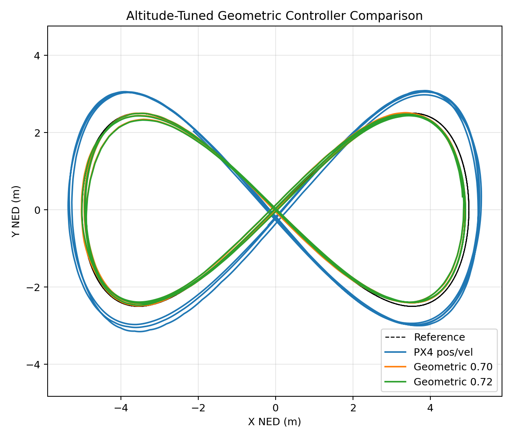
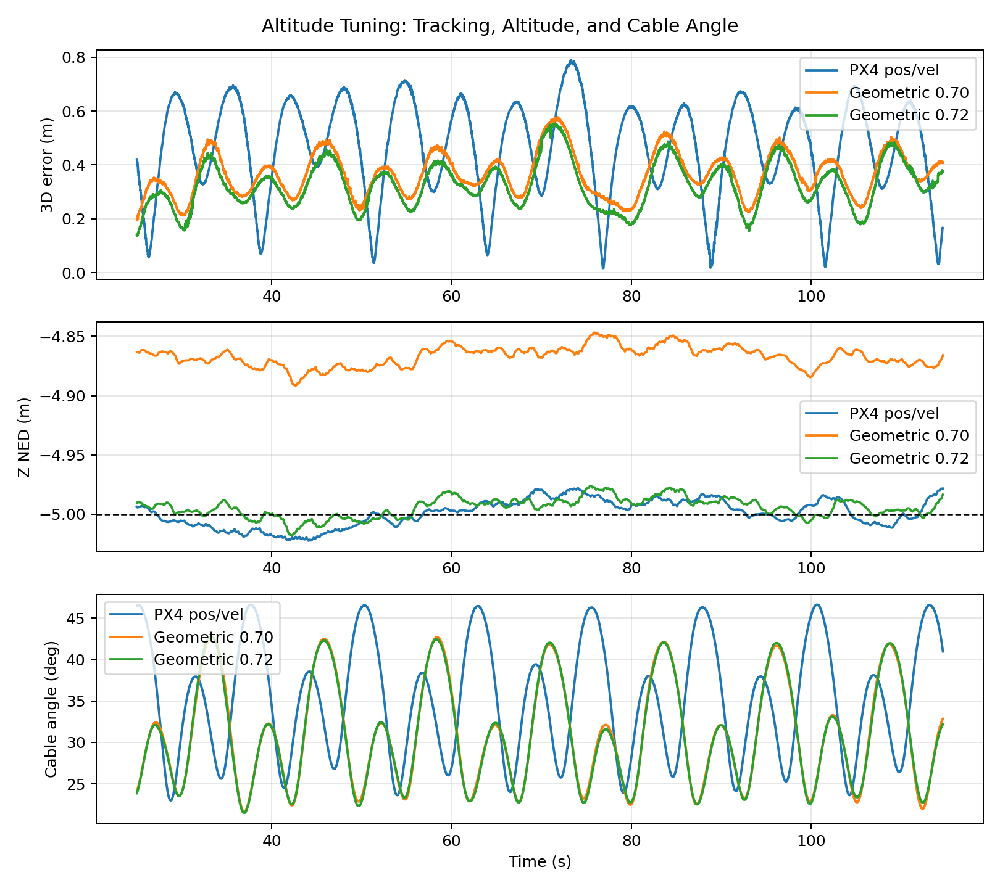
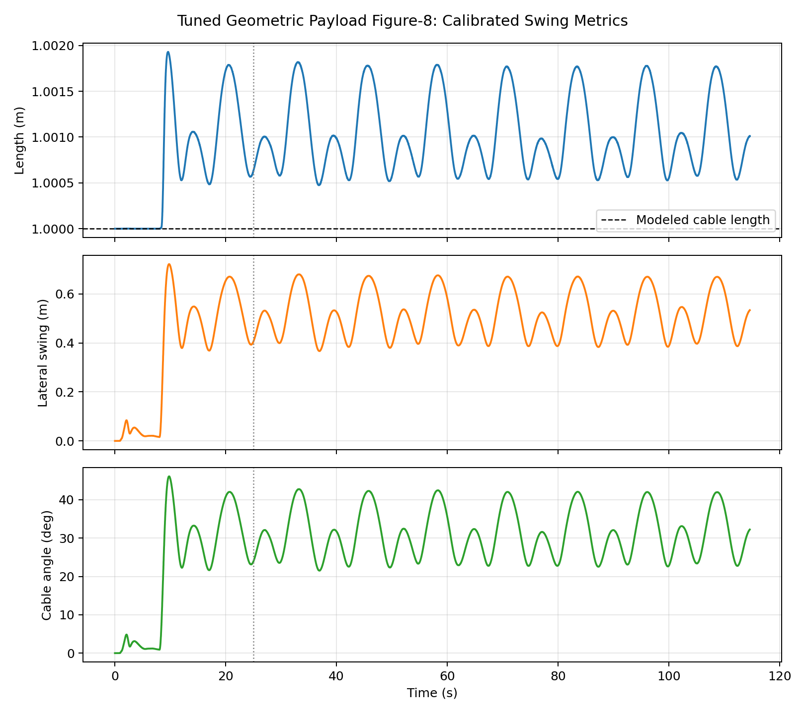

# Geometric Altitude Tuning Report - 2026-06-12

## Purpose

The calibrated controller comparison showed that the geometric attitude/thrust controller reduced tracking error and payload swing, but its altitude was biased below the target: mean `z = -4.867 m` NED against a `-5.0 m` command. This stage tunes the controller altitude/thrust scaling while preserving the calibrated swing advantage.

## Change Tested

- Previous geometric hover-thrust scale: `0.70`
- Tuned geometric hover-thrust scale: `0.72`
- Trajectory: payload Figure-8, `omega=0.25 rad/s`, amplitude `5.0 m`, target `z=-5.0 m` NED
- Payload state source: calibrated Gazebo `base_link -> slung_payload` link-pair logger
- Steady-state window: `t >= 25 s`

## Results

| Metric | PX4 Position/Velocity | Geometric `0.70` | Geometric `0.72` |
| --- | ---: | ---: | ---: |
| Mean 3D tracking error | `0.464 m` | `0.367 m` | `0.327 m` |
| RMS 3D tracking error | `0.497 m` | `0.375 m` | `0.338 m` |
| Max 3D tracking error | `0.788 m` | `0.577 m` | `0.552 m` |
| Mean XY tracking error | `0.464 m` | `0.340 m` | `0.327 m` |
| Mean altitude | `-4.999 m` NED | `-4.867 m` NED | `-4.994 m` NED |
| Mean cable length | `1.001 m` | `1.001 m` | `1.001 m` |
| Mean lateral swing | `0.573 m` | `0.514 m` | `0.513 m` |
| Mean cable angle | `35.222 deg` | `31.119 deg` | `31.061 deg` |
| Maximum cable angle | `46.617 deg` | `42.690 deg` | `42.757 deg` |

## Interpretation

The `hover_thrust=0.72` tuning fixes the main weakness of the geometric controller:

- Altitude bias reduced from `0.133 m` to `0.006 m`, a `95.6%` improvement.
- Mean tracking error improved by `10.7%` relative to the previous geometric setting.
- Against the calibrated PX4 position/velocity baseline, tuned geometric control now reduces mean tracking error by `29.5%`.
- Mean lateral swing remains reduced by `10.4%` relative to the baseline.
- Mean cable angle remains reduced by `11.8%` relative to the baseline.

This makes `hover_thrust=0.72` the new recommended default for the payload geometric Figure-8 experiment.

## Artifacts

Tuned run:

- `hover_thrust_072/geometric_ht072_tracking_metrics.csv`
- `hover_thrust_072/geometric_ht072_swing_metrics.csv`
- `hover_thrust_072/tuned_geometric_xy_tracking_steady.png`
- `hover_thrust_072/tuned_geometric_3d_tracking.png`
- `hover_thrust_072/tuned_geometric_error_altitude_swing.png`
- `hover_thrust_072/tuned_geometric_swing_metrics.png`

Comparison plots:

- `altitude_tuning_xy_comparison.png`
- `altitude_tuning_error_altitude_angle.png`

## Next Stage

Run repeatability trials for the tuned geometric controller and the calibrated PX4 baseline. The next report should include mean and standard deviation over repeated runs, which will make the controller improvement more defensible for a research update.
