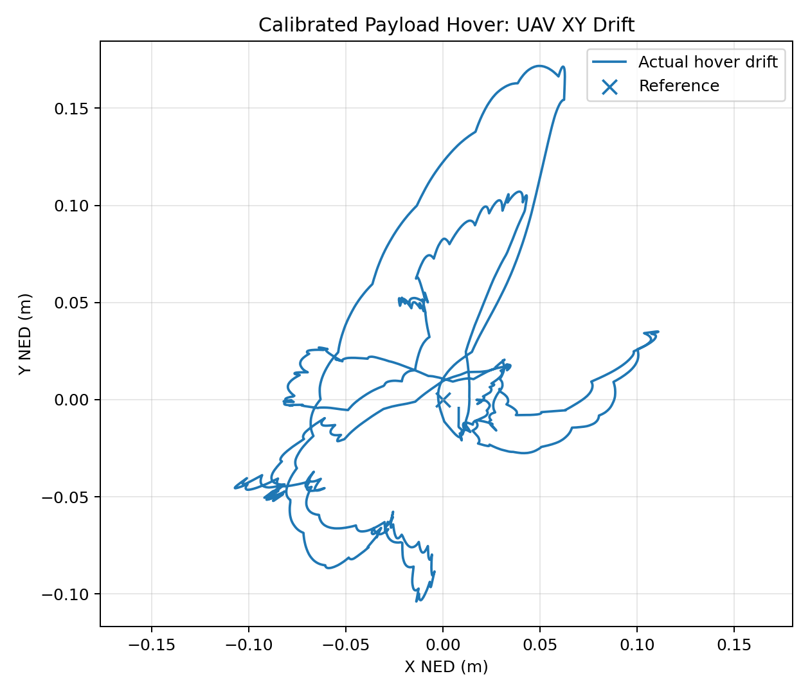
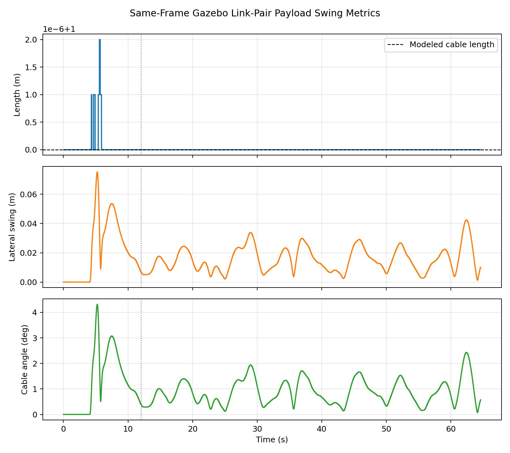
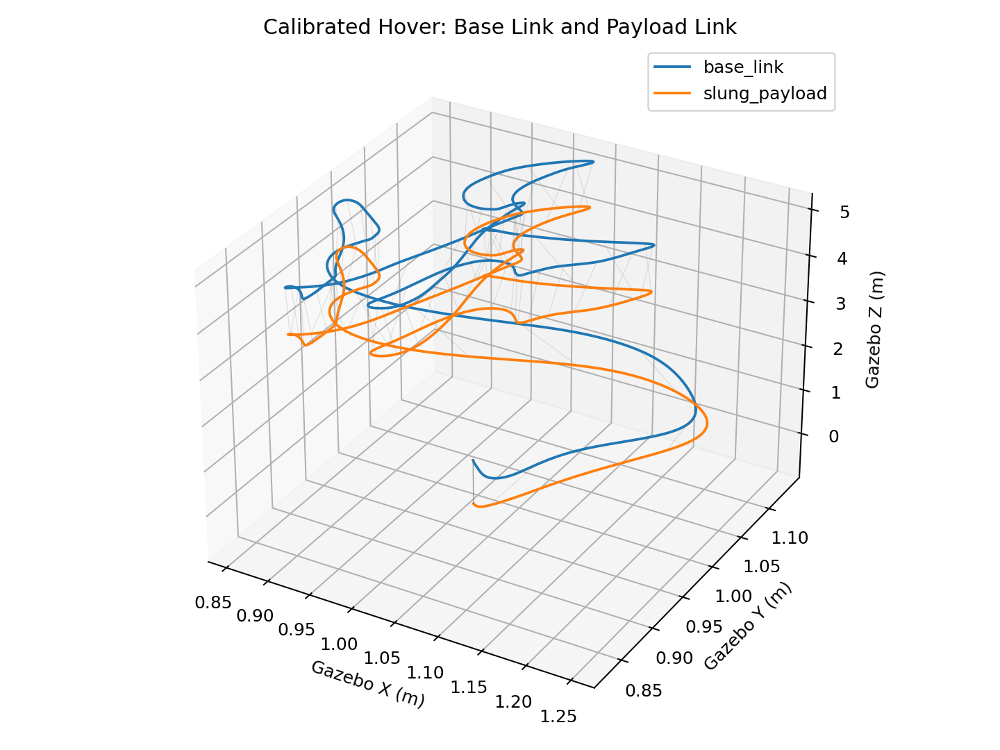
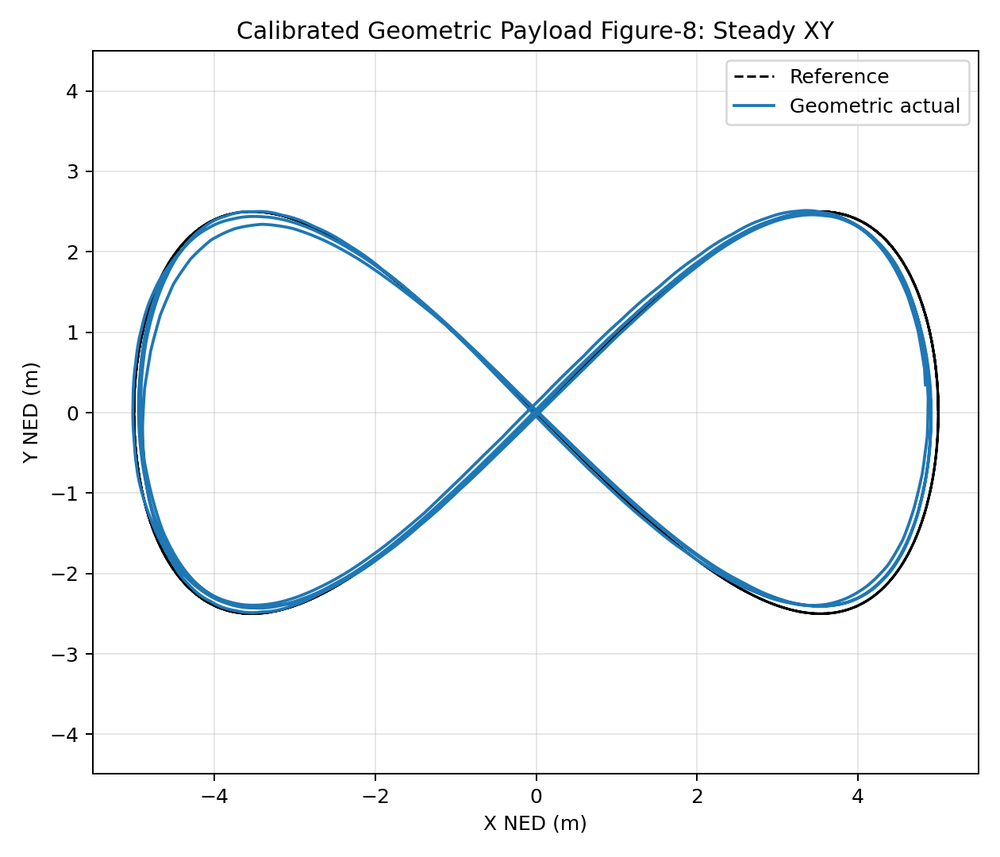
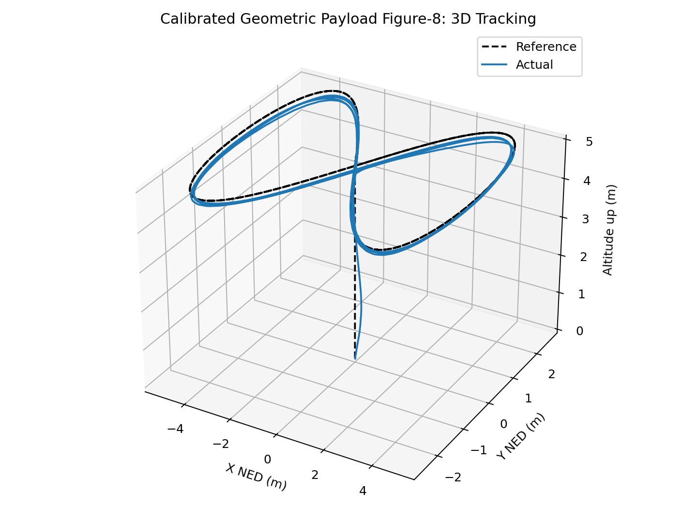
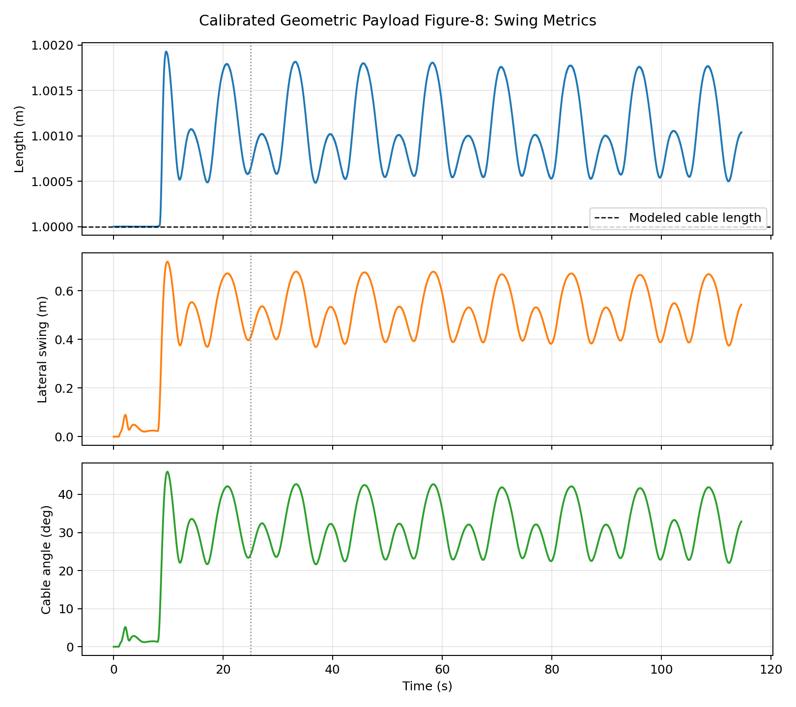

# Payload Swing Instrumentation Update - 2026-06-08

## Purpose

The matched-rate controller comparison showed a useful tracking improvement, but the payload swing numbers were still marked as diagnostic. The reason is now isolated: the previous logger mixed raw Gazebo payload-link pose with PX4 local-position estimates for the vehicle position. That is adequate for visual debugging, but it is not strong enough for research-level cable angle or swing suppression claims.

## Change Implemented

- The `iris_depth_payload` pose-sniffer plugin now publishes both `base_link` and `slung_payload` in the same UDP packet.
- `payload_swing_logger` now computes cable vector, cable length, lateral swing, and cable angle from the same Gazebo link-pose frame when both links are available.
- The PX4 local-position based calculation remains available only as a backward-compatible fallback.
- New CSV rows include a `pose_source` field:
  - `gazebo_link_pair`: calibrated same-frame Gazebo link-pair measurement.
  - `px4_local_fallback`: older mixed-frame fallback.

## Why This Matters

The expected cable length in the current visual payload model is about `1.0 m`. The old mixed-frame estimates produced larger apparent cable lengths:

| Dataset | Window | Mean Estimated Cable Length | Interpretation |
| --- | --- | ---: | --- |
| Native payload hover | `t >= 12 s` | `1.657 m` | Inflated even during hover |
| PX4 position/velocity payload Figure-8 | `t >= 25 s` | `5.271 m` | Strong frame/origin mismatch |
| Geometric payload Figure-8 | `t >= 25 s` | `4.680 m` | Diagnostic only, not final swing physics |

Because the payload trajectory videos and tracking plots are valid, this does not invalidate the controller comparison. It only means the cable-angle and lateral-swing plots should be treated as qualitative diagnostics until rerun with the same-frame logger.

## Calibrated Hover Validation Run

After the instrumentation update, the payload hover experiment was rerun with the same native ball-joint `iris_depth_payload` model.

Run artifacts:

- Tracking CSV: `calibrated_hover/hover_tracking_metrics.csv`
- Swing CSV: `calibrated_hover/payload_swing_metrics.csv`
- Hover XY drift: `calibrated_hover/calibrated_hover_xy_drift.png`
- Hover 3D trajectory: `calibrated_hover/calibrated_hover_3d.png`
- Payload link-pair 3D: `calibrated_hover/calibrated_payload_link_pair_3d.png`
- Calibrated swing metrics: `calibrated_hover/calibrated_payload_swing_metrics.png`

Steady-state window: `t >= 12 s`

| Metric | Value |
| --- | ---: |
| Swing samples | `16143` |
| Steady-state swing samples | `13148` |
| Pose source | `gazebo_link_pair` |
| Mean cable length | `1.000 m` |
| Minimum cable length | `1.000 m` |
| Maximum cable length | `1.000 m` |
| Mean lateral swing | `0.015 m` |
| Maximum lateral swing | `0.042 m` |
| Mean cable angle | `0.875 deg` |
| Maximum cable angle | `2.429 deg` |
| Mean hover tracking error | `0.065 m` |
| Mean hover altitude | `-5.001 m` NED |

Result: the same-frame Gazebo link-pair logger is validated for hover. The cable length is now physically consistent with the modeled `1.0 m` cable, and the hover swing values are small as expected for a stable suspended payload.

## Calibrated Matched-Rate Figure-8 Rerun

The matched-rate geometric payload Figure-8 was also rerun at `omega=0.25 rad/s` using the corrected logger.

Run artifacts:

- Tracking CSV: `calibrated_geometric_omega025/geometric_payload_omega025_tracking_metrics.csv`
- Swing CSV: `calibrated_geometric_omega025/geometric_payload_omega025_swing_metrics.csv`
- XY tracking: `calibrated_geometric_omega025/calibrated_geometric_xy_tracking_steady.png`
- 3D tracking: `calibrated_geometric_omega025/calibrated_geometric_3d_tracking.png`
- Error and altitude: `calibrated_geometric_omega025/calibrated_geometric_error_altitude.png`
- Calibrated swing metrics: `calibrated_geometric_omega025/calibrated_geometric_swing_metrics.png`
- Payload link-pair 3D: `calibrated_geometric_omega025/calibrated_geometric_payload_link_pair_3d.png`

Steady-state window: `t >= 25 s`

| Metric | Value |
| --- | ---: |
| Tracking samples | `5733` |
| Steady-state tracking samples | `4483` |
| Mean 3D tracking error | `0.367 m` |
| RMS 3D tracking error | `0.375 m` |
| Maximum 3D tracking error | `0.577 m` |
| Mean XY tracking error | `0.340 m` |
| Mean altitude | `-4.867 m` NED |
| Swing samples | `28637` |
| Steady-state swing samples | `22394` |
| Pose source | `gazebo_link_pair` |
| Mean cable length | `1.001 m` |
| Cable length range | `1.000 m` to `1.002 m` |
| Mean lateral swing | `0.514 m` |
| Maximum lateral swing | `0.679 m` |
| Mean cable angle | `31.119 deg` |
| Maximum cable angle | `42.690 deg` |

Result: the corrected logger preserves the earlier tracking conclusion while turning payload swing into a physically meaningful measurement. The rerun remains close to the earlier matched-rate geometric tracking result (`0.369 m` mean error), and the cable length now stays locked to the modeled 1 m cable instead of drifting into multi-meter artifacts.

## Next Validation Run

The next simulation should rerun the PX4 position/velocity payload Figure-8 baseline with the same corrected logger, so both controllers have calibrated swing metrics.

- Acceptance criterion: `pose_source` should be `gazebo_link_pair` for all steady-state samples.
- The calibrated baseline swing can then be compared directly against the calibrated geometric-controller swing.

## Files Updated

- `ros2_ws/src/uav_control/scripts/payload_swing_logger`
- `px4_payload_integration/Tools/simulation/gazebo-classic/sitl_gazebo-classic/models/iris_depth_payload/iris_depth_payload.sdf`
- Live PX4 model at `/home/paneendra/PX4-Autopilot/Tools/simulation/gazebo-classic/sitl_gazebo-classic/models/iris_depth_payload/iris_depth_payload.sdf`
- Live ROS logger at `/home/paneendra/ros2_ws/src/uav_control/scripts/payload_swing_logger`
