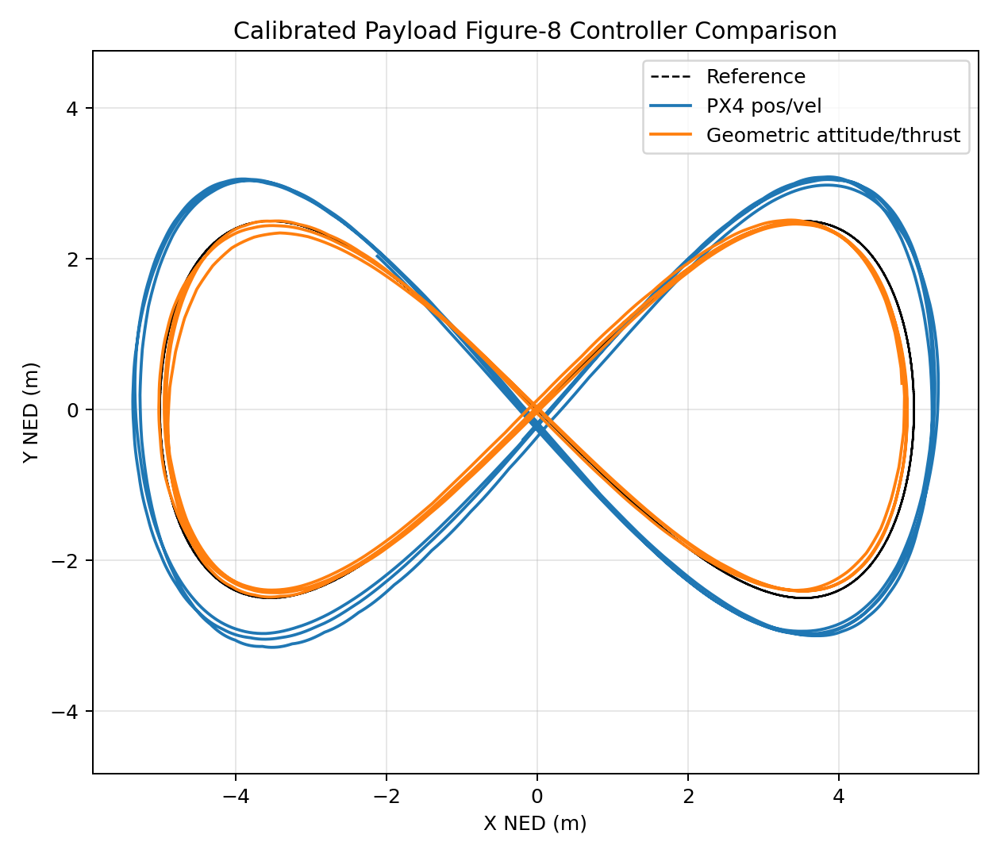
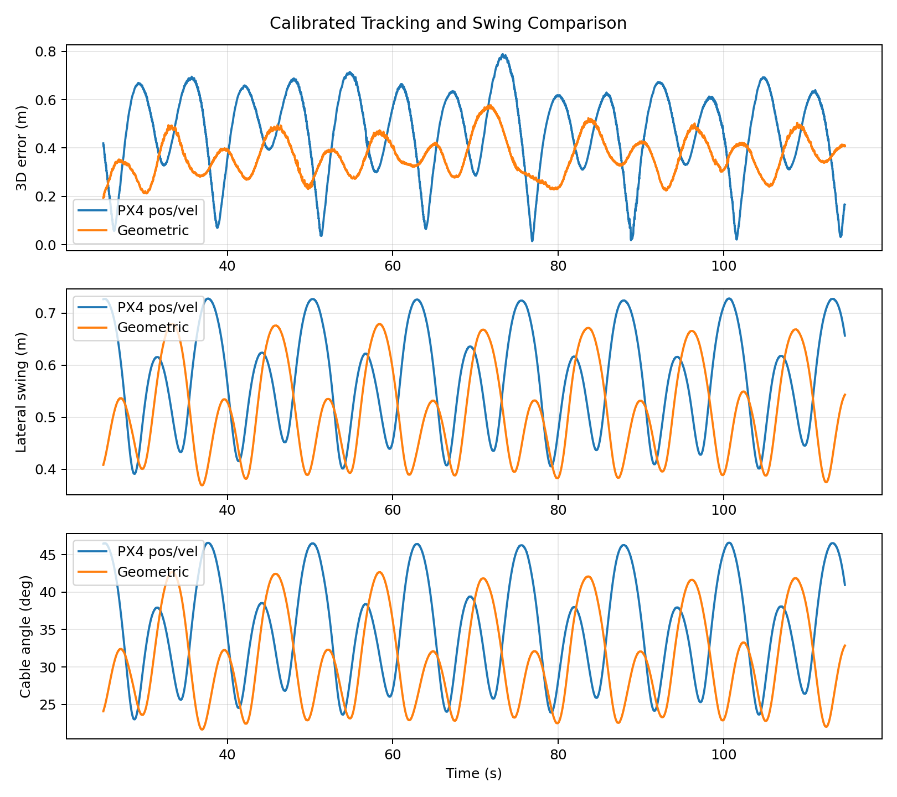
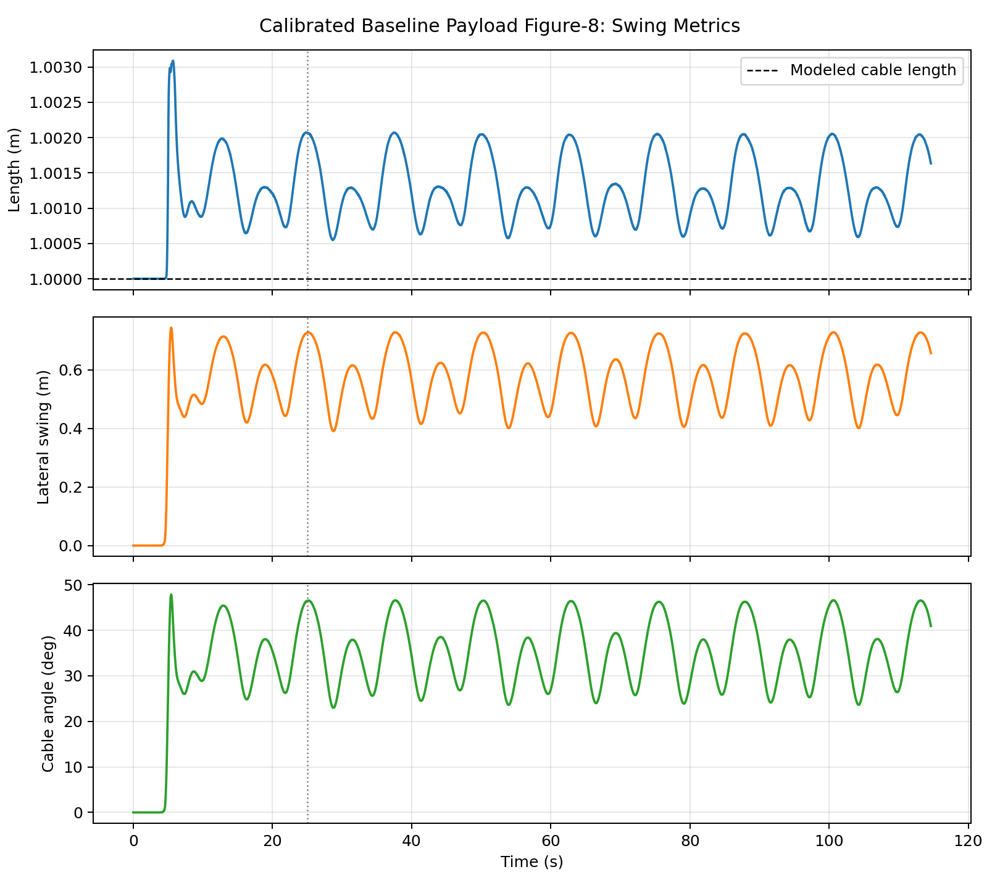

# Calibrated Payload Controller Swing Comparison - 2026-06-12

## Purpose

This stage closes the open comparison left after the payload swing logger calibration. The PX4 position/velocity payload Figure-8 baseline was rerun with the same corrected Gazebo link-pair logger used by the geometric controller run. Both controllers now have calibrated tracking and payload-swing measurements at `omega=0.25 rad/s`.

## Experimental Setup

- Vehicle: `iris_depth_payload`
- Payload joint: native internal `base_link -> slung_payload` ball joint
- Trajectory: continuous Figure-8 / lemniscate
- Amplitude: `5.0 m`
- Angular rate: `0.25 rad/s`
- Target altitude: `-5.0 m` NED
- Steady-state window: `t >= 25 s`
- Payload measurement source: same-frame Gazebo `base_link` and `slung_payload` poses

## Calibrated Controller Results

| Metric | PX4 Position/Velocity | Geometric Attitude/Thrust |
| --- | ---: | ---: |
| Tracking samples | `5732` | `5733` |
| Duration | `114.638 s` | `114.664 s` |
| Mean 3D tracking error | `0.464 m` | `0.367 m` |
| RMS 3D tracking error | `0.497 m` | `0.375 m` |
| Maximum 3D tracking error | `0.788 m` | `0.577 m` |
| Mean XY tracking error | `0.464 m` | `0.340 m` |
| Mean altitude | `-4.999 m` NED | `-4.867 m` NED |
| Pose source | `gazebo_link_pair` | `gazebo_link_pair` |
| Mean cable length | `1.001 m` | `1.001 m` |
| Cable length range | `1.001` to `1.002 m` | `1.000` to `1.002 m` |
| Mean lateral swing | `0.573 m` | `0.514 m` |
| Maximum lateral swing | `0.728 m` | `0.679 m` |
| Mean cable angle | `35.222 deg` | `31.119 deg` |
| Maximum cable angle | `46.617 deg` | `42.690 deg` |

## Interpretation

The geometric attitude/thrust controller remains better after both controllers are measured with the calibrated same-frame payload logger:

- Mean 3D tracking error reduced by `21.0%`.
- Mean lateral payload swing reduced by `10.3%`.
- Mean cable angle reduced by `11.7%`.

The cable length stays close to the modeled `1.0 m` in both runs, which confirms the swing comparison is no longer affected by the earlier PX4/Gazebo frame mismatch. The geometric controller still flies slightly below the target altitude compared with PX4 position/velocity control, so altitude tuning remains the next controller-improvement task.

## Artifacts

Baseline rerun:

- `calibrated_baseline_omega025/baseline_payload_omega025_tracking_metrics.csv`
- `calibrated_baseline_omega025/baseline_payload_omega025_swing_metrics.csv`
- `calibrated_baseline_omega025/calibrated_baseline_xy_tracking_steady.png`
- `calibrated_baseline_omega025/calibrated_baseline_3d_tracking.png`
- `calibrated_baseline_omega025/calibrated_baseline_error_altitude.png`
- `calibrated_baseline_omega025/calibrated_baseline_swing_metrics.png`

Controller comparison:

- `calibrated_controller_xy_comparison.png`
- `calibrated_controller_error_swing_comparison.png`

## Next Stage

Tune the geometric controller altitude channel while preserving the swing reduction. The target is to bring mean altitude closer to `-5.0 m` NED without increasing mean cable angle above the calibrated geometric value of `31.119 deg`.
